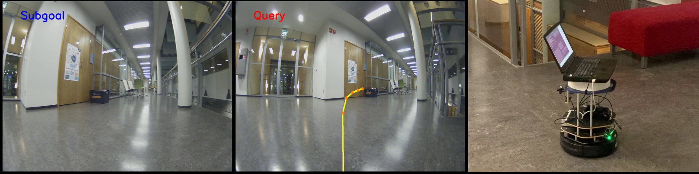

# PlaceNav: Topological Navigation through Place Recognition
#### Lauri Suomela, Jussi Kalliola, Harry Edelman, Joni-Kristian Kämäräinen

_Computer Vision Group, Tampere University, Finland_


( [Project Page](https://lasuomela.github.io/placenav/) | [Citing](#citing) )



This is the official implementation of the ICRA 2024 paper _"PlaceNav: Topological Navigation through Place Recognition"_. The paper shows how to use place recogition models for the task of subgoal selection in vision-based topological navigation. Place recognition solves the task more efficiently and with a higher accuracy than the previous approaches.

## Overview

This repository contains code for deploying the PlaceNav navigation system on a TurtleBot2 robot.

- `./src/record_bag_turtlebot.sh`: script to collect a demo trajectory in the target environment on the robot. This trajectory is subsampled to generate a topological graph of the environment.
- `./src/navigate_turtlebot.sh`: script that deploys PlaceNav on the robot to navigate to a desired goal in the generated topological graph. Please see relevant sections below for configuration settings.


## Turtlebot2 Setup

We recommend running the software on a Linux machine using the provided Docker image. Although the system should also work on a CPU (not tested), we recommend using a machine with a GPU. The method has been tested with a laptop running Ubuntu 22.04.

<details><summary><b><font size="+3">Software setup (Docker)</font></b></summary><br/>

We provide a Docker image for easy software setup. The image includes all the software dependencies required to run PlaceNav (including the Turtlebot2 driver install for ROS Noetic). The image was built for `x86_64` CPU architectures. It is based on `CUDA:11.3.0`, which has the minimum Host OS Nvidia driver version requirement `>=450.80.02`. Newer Nvidia drivers [should be backward compatible](https://docs.nvidia.com/datacenter/cloud-native/container-toolkit/1.13.5/install-guide.html#platform-requirements) with the CUDA toolkit.

Steps to run:
1. Install [Docker](https://docs.docker.com/engine/install/) and [NVIDIA Container toolkit](https://docs.nvidia.com/datacenter/cloud-native/container-toolkit/latest/install-guide.html).
2. Navigate to `./docker/turtlebot`.
3. Execute `./build.sh`. This pulls the image from Docker Hub.
4. If building for first time, restart the machine to update udev rules. Otherwise you will have trouble connecting to the Turtlebot from inside the container.
5. Check if `run.sh` volume mount paths (`-v host_path:container_path`) are valid for your system.
6. Execute `./run.sh`.
7. Done! You should enter the container bash shell.

You can also build the Docker image yourself using the provided Dockerfile. Local build can be triggered by

```
./build.sh -r ""
```

Building for devices such as NVIDIA Jetson's will probably require some modifications to the Dockerfile (e.g. changing the base image).

</details>
<details><summary><b><font size="+3">Software setup (Host OS) </font></b></summary><br/>
  
If you want to set up the software without using Docker, please follow the steps in `./docker/turtlebot/build.sh` and `./docker/turtlebot/Dockerfile`. They list all the dependencies required for the system to work. However, we don't promise support for such attempts.


</details>
<details><summary><b><font size="+3"> Hardware Requirements </font></b></summary><br/>

- Turtlebot2: [www.turtlebot.com/turtlebot2/](https://www.turtlebot.com/turtlebot2/). PlaceNav has been tested on the Turtlebot2 and Robotnik Summit-XL Steel robots. Lot of the code has been adopted from [GNM](https://github.com/robodhruv/drive-any-robot), which has been adapted multiple different robots, so utilizing PlaceNav with different robots should be easy.
- [A wide-angle RGB camera](https://www.arducam.com/product/arducam-imx291-usb-camera-with-case-b026101/). The `turtlebot.launch` launches a camera node with parameters in `./src/config/camera.yaml`. If you have calibrated your camera, you can add the intrinsics to `./src/config/calibration.yaml` for accurate visualization of predicted waypoints. 
- [Joystick](https://www.amazon.com/DualShock-Wireless-Controller-PlayStation-Black-4/dp/B01LWVX2RG)/[keyboard teleop](http://wiki.ros.org/teleop_twist_keyboard) that works with Linux. Add the index mapping for the _deadman_switch_ on the joystick to the `./src/config/joystick.yaml`. You can find the mapping from buttons to indices for common joysticks in the [wiki](https://wiki.ros.org/joy). 
</details>

## Loading the model weights

Save the model weights *.pth files in `./src/model_weights` folder. GNM weights can be found from [this link](https://drive.google.com/file/d/1WluphDqeTY5eTGp98Nkc3St6fr9PyrA5/view?usp=drive_link), and our low-resolution CosPlace weights from [this link](https://drive.google.com/file/d/1M1rvlRYiV9F0VHKggAOyzun4PwGFTlZ1/view?usp=sharing).

## Collecting a Topological Map

_Make sure to run these scripts inside the `./src/` directory._

This section discusses a simple way to create a topological map of the target environment for deployment. For simplicity, we will use the robot in “path-following” mode, i.e. given a single trajectory in an environment, the task is to follow the same trajectory to the goal.

<details><summary><b><font size="+3"> Record the rosbag </font></b></summary><br/>
  
```bash
./record_bag_turtlebot.sh <bag_name>
```

Run this command to teleoperate the robot with the joystick and camera. This command opens up three windows 
1. `roslaunch turtlebot.launch`: This launch file opens the `usb_cam` node for the camera, the joy node for the joystick, and several nodes for the robot’s mobile base).
2. `python joy_teleop.py`: This python script starts a node that reads inputs from the joy topic and outputs them on topics that teleoperate the robot’s base.
3. `rosbag record /usb_cam/image_raw /odom -o <bag_name>`: This command isn’t run immediately (you have to click Enter). It will be run in the `./src/topomaps/bags` directory, where we recommend you store your rosbags.

Once you are ready to record the bag, run the `rosbag record` script and teleoperate the robot on the map you want the robot to follow. When you are finished with recording the path, kill the `rosbag record` command, and then kill the tmux session.

</details>
<details><summary><b><font size="+3"> Create the topological map </font></b></summary><br/>
  
```bash
./create_topomap.sh <topomap_name> <bag_filename>
```

This command opens up 3 windows:
1. `roscore`
2. `python create_topomap.py —dt 1 —dir <topomap_dir>`: This command creates a directory in `./src/topomaps/images` and saves an image as a node in the map every second the bag is played.
3. `rosbag play -r 5 <bag_filename>`: This command plays the rosbag at x5 speed, so the python script is actually recording nodes 5 seconds apart. The `<bag_filename>` should be the entire bag name with the .bag extension. You can change this value in the `make_topomap.sh` file. The command does not run until you hit Enter, which you should only do once the python script gives its waiting message. Once you play the bag, move to the screen where the python script is running so you can kill it when the rosbag stops playing.

When the bag stops playing, kill the tmux session.
</details>

## Running the model 
_Make sure to run this script inside the `./src/` directory._

You can run the model by specifying desired parameters to the `./src/navigate_turtlebot.sh` script.
Options are:
```bash
./navigate_turtlebot.sh “--wp-model <gnm_large> --pr-model <cosplace> --subgoal-mode <temporal_distance | place_recognition> --filter-mode <sliding_window | bayesian> --topomap-dir <your_test_dir>”
```
_E.g._

```bash
./navigate_turtlebot.sh “--wp-model gnm_large --pr-model cosplace --subgoal-mode place_recognition --filter-mode bayesian --topomap-dir <your_test_dir>”
```

The config files for the model and robot parameters can be found in `./src/config`. Make sure the model configurations match the training of the model you are using.

<details><summary><b><font size="+2">Details </font></b></summary><br/>

The `<topomap_dir>` is the name of the directory in `./src/topomaps/images` that has the images corresponding to the nodes in the topological map. The images are ordered by name from 0 to N.

`navigate.py` opens up 5 windows:

1. `roslaunch turtlebot.launch`: This launch file opens the usb_cam node for the camera, the joy node for the joystick, and several nodes for the robot’s mobile base).
2. `python navigate.py`: This python script starts a node that reads in image observations from the camera topic, inputs the observations and the map into the models, and publishes actions to the `/waypoint` topic.
3. `python joy_teleop.py`: This python script starts a node that reads inputs from the joy topic and outputs them on topics that teleoperate the robot’s base.
4. `python pd_controller.py`: This python script starts a node that reads messages from the `/waypoint` topic (waypoints from the model) and outputs velocities to navigate the robot’s base.
5. `python visualization_node.py`: This python script starts a node that visualizes the each query image and the corresponding retrieved subgoal image, with predicted waypoints overlaid on the query image. By default, images are shown on screen and saved to disk as a video. Behavior can be controlled using the `--save` and `--show` flags.

If you are running on-screen visualization, pressing key `q` will stop the navigation loop. Otherwise, terminate `navigate.py` manually. If you want to take control of the robot while it is navigating, the `joy_teleop.py` script allows you to do so with the joystick.

</details>

## Train a place recognition model

To train your own place recognition models, please follow the instructions in the [CosPlace](https://github.com/gmberton/CosPlace) repo. As a modification to the standard training procedure, you will probably want to specify the training image size with the `train.py` flags `--image_size <your_image_size> --resize_test_imgs`. We suggest using `--image_size 85` for compatibility with the GNM waypoint prediction model.

## Acknowledgements
Parts of this repo are inspired by the following repositories:

[GNM: A General Navigation Model to Drive Any Robot](https://github.com/robodhruv/drive-any-robot) <br/>
[hloc - the hierarchical localization toolbox](https://github.com/cvg/Hierarchical-Localization) <br/>
[visual_robot_localization](https://github.com/lasuomela/visual_robot_localization) <br/>
[CosPlace](https://github.com/gmberton/CosPlace)

## Citing

```
@InProceedings{Suomela_2024_Placenav,
author    = {Suomela, Lauri and Kalliola, Jussi and Edelman, Harry and Kämäräinen, Joni-Kristian},
title     = {PlaceNav: Topological Navigation through Place Recognition},
booktitle = {IEEE International Conference on Robotics and Automation (ICRA)},
year      = {2024},
url       = {https://arxiv.org/abs/2309.17260},
}
```
